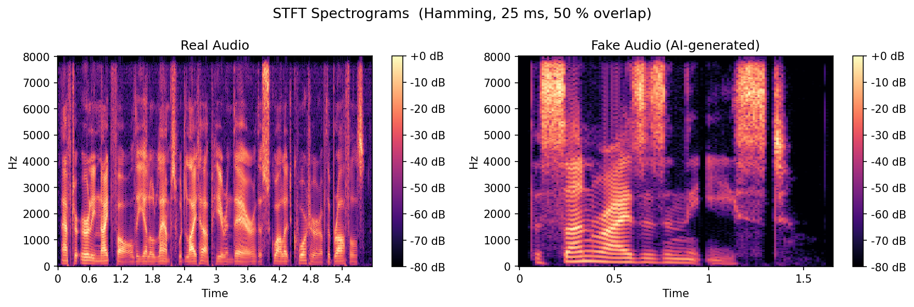

# Audio Deepfake Detection Using Classical DSP

A classical digital signal processing and machine-learning pipeline for distinguishing real human speech from AI-generated speech. The project analyzes short-time spectral behavior, extracts compact audio features, and compares four traditional classifiers without relying on deep learning.

The best-performing configuration combines seven DSP features with 13 MFCC means and achieves **98.5% test accuracy** using an RBF-kernel Support Vector Machine.

## Project Overview

Modern text-to-speech and voice-cloning systems can produce highly realistic audio. Even when synthetic speech sounds natural, it may retain measurable differences in spectral shape, energy variation, periodicity, phase, and short-time behavior.

This project detects those differences using the following pipeline:

```text
Audio file
  -> Resampling and normalization
  -> Pre-emphasis filtering
  -> 25 ms framing and Hamming windowing
  -> FFT/STFT analysis
  -> DSP and MFCC feature extraction
  -> Machine-learning classifier
  -> Real or fake prediction
```

## Highlights

- Uses classical DSP instead of a deep neural network
- Processes all audio as 16 kHz mono
- Applies peak normalization and a first-order FIR pre-emphasis filter
- Uses 25 ms frames with 50% overlap and Hamming windows
- Compares seven baseline DSP features with an extended 20-feature representation
- Evaluates SVM, KNN, Logistic Regression, and Decision Tree classifiers
- Generates waveforms, spectra, spectrograms, MFCC heatmaps, confusion matrices, and feature-importance plots
- Uses an 80/20 stratified train-test split with random seed 42

## Dataset

The balanced dataset contains **1,000 audio samples**:

- 500 real speech recordings from LibriSpeech
- 500 AI-generated recordings produced using the OpenAI TTS Alloy voice

The dataset is excluded from Git through `.gitignore`. To run the project, place the audio files in the following structure:

```text
dataset/
├── real/
│   └── real_audio_files.wav
└── fake/
    └── fake_audio_files.wav
```

Supported formats are WAV, FLAC, OGG, and MP3.

## Signal-Processing Configuration

| Setting | Value |
|---|---:|
| Sample rate | 16,000 Hz |
| Frame length | 25 ms / 400 samples |
| Hop length | 12.5 ms / 200 samples |
| Frame overlap | 50% |
| Window | Hamming |
| Pre-emphasis coefficient | 0.97 |
| MFCC coefficients | 13 |

The pre-emphasis filter is defined by:

```text
y[n] = x[n] - 0.97x[n-1]
H(z) = 1 - 0.97z^-1
```

## Extracted Features

### Baseline Feature Set

Seven frame-level DSP features are calculated and averaged over each audio file:

1. Zero-crossing rate
2. Short-time energy
3. Spectral centroid
4. Spectral bandwidth
5. Spectral rolloff at 85% energy
6. Spectral flatness
7. Normalized autocorrelation peak

### Extended Feature Set

The extended representation adds the mean values of 13 Mel-Frequency Cepstral Coefficients, producing a total of 20 features per audio file.

MFCCs describe the broad spectral envelope of speech and improve the separation between real and AI-generated samples.

## Classifiers

| Classifier | Configuration |
|---|---|
| Support Vector Machine | RBF kernel, `C=10`, `gamma="scale"` |
| K-Nearest Neighbors | `k=5` |
| Logistic Regression | `max_iter=2000` |
| Decision Tree | `max_depth=6` |

SVM, KNN, and Logistic Regression use standardized features. The Decision Tree uses the original feature values because tree-based models are not affected by feature scaling.

## Results

### Seven Baseline DSP Features

| Classifier | Accuracy | Precision | Recall | F1-score |
|---|---:|---:|---:|---:|
| SVM (RBF) | 97.00% | 98.96% | 95.00% | 96.94% |
| KNN (k=5) | 95.50% | 98.92% | 92.00% | 95.34% |
| Logistic Regression | 83.00% | 81.13% | 86.00% | 83.50% |
| Decision Tree | 91.00% | 94.57% | 87.00% | 90.62% |

### Seven DSP Features and 13 MFCCs

| Classifier | Accuracy | Precision | Recall | F1-score |
|---|---:|---:|---:|---:|
| **SVM (RBF)** | **98.50%** | **100.00%** | **97.00%** | **98.48%** |
| KNN (k=5) | 97.00% | 100.00% | 94.00% | 96.91% |
| Logistic Regression | 95.50% | 97.89% | 93.00% | 95.38% |
| Decision Tree | 97.00% | 98.96% | 95.00% | 96.94% |

The best model correctly classified all 100 real test samples and 97 of 100 fake samples.

## Visualizations

### Real and AI-Generated STFT Spectrograms



### Best Model Confusion Matrix


## Repository Structure

```text
.
├── attributes.py          # Shared paths and DSP parameters
├── preprocessing.py       # Loading, resampling, normalization, pre-emphasis
├── filters.py             # Pre-emphasis filter analysis
├── features.py            # DSP and MFCC feature extraction
├── classification.py      # Classifier training, evaluation, and metrics
├── visualizations.py      # Waveform, FFT, STFT, MFCC, and feature plots
├── main.py                # Complete end-to-end pipeline
├── plots/                 # Generated figures and confusion matrices
├── results/
│   └── metrics.txt        # Saved performance table
└── dataset/               # Local audio dataset, excluded from Git
```

## Installation

Python 3.10 or newer is recommended.

Clone the repository:

```bash
git clone https://github.com/omarshobaki-png/Deepfake-Audio-Detector.git
cd Deepfake-Audio-Detector
```

Create a virtual environment:

```bash
python -m venv .venv
```

Activate it on Windows:

```powershell
.venv\Scripts\Activate.ps1
```

Activate it on macOS or Linux:

```bash
source .venv/bin/activate
```

Install the required packages:

```bash
pip install numpy scipy pandas matplotlib librosa scikit-learn
```

## Usage

1. Add the real and fake audio files under `dataset/real/` and `dataset/fake/`.
2. Run the complete pipeline:

```bash
python main.py
```

The program will:

- Load and preprocess the dataset
- Generate DSP visualizations
- Analyze the pre-emphasis filter
- Build the baseline and extended feature matrices
- Train and evaluate all four classifiers
- Save figures under `plots/`
- Save the performance table to `results/metrics.txt`

## DSP Interpretation

The experimental results suggest several differences between real and AI-generated speech:

- AI speech can have a smoother and more uniform spectrum because it is produced by a synthesis system.
- Real speech often contains more short-time energy variation caused by natural rhythm, breathing, pauses, and articulation.
- Real voiced speech can produce stronger autocorrelation peaks due to natural vocal-fold periodicity.
- MFCCs capture differences in the spectral envelope and formant structure of real and generated speech.
- The RBF SVM performs well because the two classes cannot be separated effectively using only a simple linear boundary.

## Limitations

- The dataset contains one synthetic voice and may not represent every voice-cloning system.
- Performance was measured using clean, balanced, 16 kHz audio.
- Robustness to background noise, reverberation, compression, unseen speakers, and newer TTS models has not been established.
- The current project evaluates a complete dataset but does not yet provide a saved production model or single-file prediction command.
- Results should not be treated as proof that an audio recording is authentic or fake in high-stakes situations.

## Future Work

- Evaluate additional TTS and voice-cloning systems
- Test background noise, MP3 compression, and channel distortion
- Add group-delay and phase-based features
- Compare additional FIR and IIR filters
- Save the trained model and add single-file inference
- Use cross-validation and an external test dataset
- Develop a simple graphical or web interface

## Project Paper

The complete IEEE-style project report is available here:

[Read the full project paper](1230329_1230559_DSP_ProjReport.pdf)

## Authors

- **Omar Shoubaki** — 1230329
- **Omar Rabieh** — 1230559

DSP Course Project, Birzeit University.
